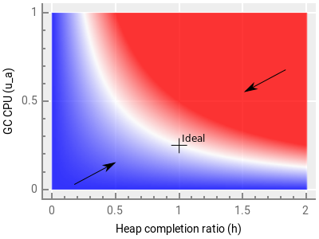
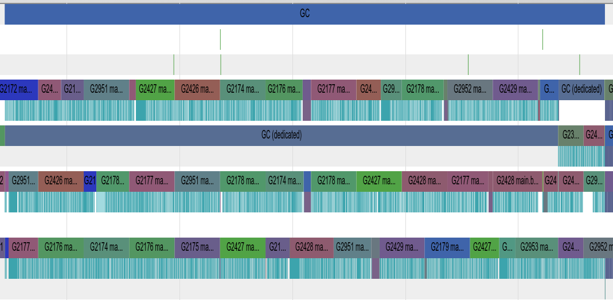
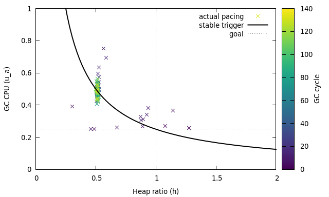
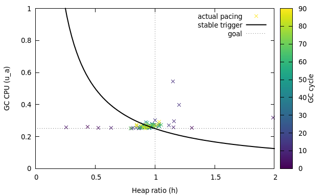

# Proposal: Separate soft and hard heap size goal

Author(s): Austin Clements

Inspired by discussion with Rick Hudson and Rhys Hiltner

Last updated: 2017-10-31

Discussion at https://golang.org/issue/13951.

## Background

The GC pacer is responsible for determining when to start a GC cycle
and how much back-pressure to put on allocation to prevent exceeding
the goal heap size.
It aims to balance two goals:

1. Complete marking before the allocated heap exceeds the GOGC-based
   goal heap size.

2. Minimize GC CPU consumed beyond the 25% reservation.

In order to satisfy the first goal, the pacer forces the mutator to
assist with marking if it is allocating too quickly.
These mark assists are what cause GC CPU to exceed the 25%, since the
scheduler dedicates 25% to background marking without assists.
Hence, to satisfy the second goal, the pacer's trigger controller sets
the GC trigger heap size with the goal of starting GC early enough
that no assists are necessary.
In addition to reducing GC CPU overhead, minimizing assists also
reduces the per-goroutine latency variance caused by assists.

In practice, however, the trigger controller does not achieve the goal
of minimizing mark assists because it stabilizes on the wrong steady
state.
This document explains what happens and why and then proposes a
solution.

For a detailed description of the pacer, see the [pacer design
document](http://golang.org/s/go15gcpacing).
This document follows the nomenclature set out in the original design,
so it may be useful to review the original design document first.

## Problem

The trigger controller is a simple proportional feedback system based
on two measurements that directly parallel the pacer's two goals:

1. The *actual* heap growth *ha* at which marking
   terminates, as a fraction of the heap goal size.
   Specifically, it uses the overshoot ratio
   *h*&nbsp;=&nbsp;(*ha*&nbsp;−&nbsp;*hT*)/(*hg*−*hT*),
   which is how far between the trigger *hT* and the goal
   *hg* the heap was at completion.
   Ideally, the pacer would achieve *h*&nbsp;=&nbsp;1.

2. The *actual* GC CPU consumed *ua* as a fraction of the
   total CPU available.
   Here, the goal is fixed at *ug*&nbsp;=&nbsp;0.25.

Using these, the trigger controller computes the error in the trigger
and adjusts the trigger based on this error for the next GC cycle.
Specifically, the error term is

However, *e*(*n*)&nbsp;=&nbsp;0 not only in the desired case of
*h*&nbsp;=&nbsp;1, *ua*&nbsp;=&nbsp;*ug*, but in
any state where *h*&nbsp;=&nbsp;*ug*/*ua*.
As a result, the trigger controller can stabilize in a state that
undershoots the heap goal and overshoots the CPU goal.
We can see this in the following
[plot](https://gist.github.com/aclements/f7a770f9cb5682e038fe3f6ebd66bcba)
of *e*(*n*), which shows positive error in blue, negative error in
red, and zero error in white:

Coupled with how GC paces assists, this is exactly what happens when
the heap size is stable.
To satisfy the heap growth constraint, assist pacing conservatively
assumes that the entire heap is live.
However, with a GOGC of 100, only *half* of the heap is live in steady
state.
As a result, marking terminates when the allocated heap is only half
way between the trigger and the goal, i.e., at *h*&nbsp;=&nbsp;0.5
(more generally, at *h*&nbsp;=&nbsp;100/(100+GOGC)).
This causes the trigger controller to stabilize at
*ua*&nbsp;=&nbsp;0.5, or 50% GC CPU usage, rather than
*ua*&nbsp;=&nbsp;0.25.
This chronic heap undershoot leads to chronic CPU overshoot.

### Example

The garbage benchmark demonstrates this problem nicely when run as
`garbage -benchmem 512 -benchtime 30s`.
Even once the benchmark has entered steady state, we can see a
significant amount of time spent in mark assists (the narrow cyan
regions on every other row):

Using `GODEBUG=gcpacertrace=1`, we can
[plot](https://gist.github.com/aclements/6701446d1ef39e42f3337f00a6f94973)
the exact evolution of the pacing parameters:

The thick black line shows the balance of heap growth and GC CPU at
which the trigger error is 0.
The crosses show the actual values of these two at the end of each GC
cycle as the benchmark runs.
During warmup, the pacer is still adjusting to the rapidly changing
heap.
However, once the heap enters steady state, GC reliably finishes at
50% of the target heap growth, which causes the pacer to dutifully
stabilize on 50% GC CPU usage, rather than the desired 25%, just as
predicted above.

## Proposed solution

I propose separating the heap goal into a soft goal, *hg*,
and a hard goal, *hg'*, and setting the assist pacing such
the allocated heap size reaches the soft goal in *expected
steady-state* (no live heap growth), but does not exceed the hard goal
even in the worst case (the entire heap is reachable).
The trigger controller would use the soft goal to compute the trigger
error, so it would be stable in the steady state.

Currently the work estimate used to compute the assist ratio is simply
*We*&nbsp;=&nbsp;*s*, where *s* is the bytes of scannable
heap (that is, the total allocated heap size excluding no-scan tails
of objects).
This worst-case estimate is what leads to over-assisting and
undershooting the heap goal in steady state.

Instead, between the trigger and the soft goal, I propose using an
adjusted work estimate
*We*&nbsp;=&nbsp;*s*/(1+*hg*).
In the steady state, this would cause GC to complete when the
allocated heap was roughly the soft heap goal, which should cause the
trigger controller to stabilize on 25% CPU usage.

If allocation exceeds the soft goal, the pacer would switch to the
worst-case work estimate *We*&nbsp;=&nbsp;*s* and aim for
the hard goal with the new work estimate.

This leaves the question of how to set the soft and hard goals.
I propose setting the soft goal the way we currently set the overall
heap goal: *hg*&nbsp;=&nbsp;GOGC/100, and setting the hard
goal to allow at most 5% extra heap growth:
*hg'*&nbsp;=&nbsp;1.05*hg*.
The consequence of this is that we would reach the GOGC-based goal in
the steady state.
In a heap growth state, this would allow heap allocation to overshoot
the GOGC-based goal slightly, but this is acceptable (maybe even
desirable) during heap growth.
This also has the advantage of allowing GC to run less frequently by
targeting the heap goal better, thus consuming less total CPU for GC.
It will, however, generally increase heap sizes by more accurately
targeting the intended meaning of GOGC.

With this change, the pacer does a significantly better job of
achieving its goal on the garbage benchmark:

As before, the first few cycles have high variance from the goal
because the heap is growing rapidly, so the pacer cannot find a stable
point.
However, it then quickly converges near the optimal point of reaching
the soft heap goal at 25% GC CPU usage.

Interestingly, while most of the variance in the original design was
around GC CPU usage, that variance has been traded to the heap ratio
in this new design[o][p].
This is because the scheduler *does not allow* GC CPU usage to drop
below 25%.
Hence, the controller saturates and the inherent variance shifts to
the less constrained dimension.

To address this, I propose making one further change: dedicate only
20% of the CPU to background marking, with the expectation that 5%
will be used for mark assists in the steady state.
This keeps the controller out of saturation and gives it some "wiggle
room", while still minimizing time spent in mark assists The result is
very little variance from the goal in either dimension in the steady
state:

## Evaluation

To evaluate this change, we use the go1 and x/benchmarks suites.
All results are based on [CL 59970 (PS2)](http://golang.org/cl/59970)
and [CL 59971 (PS3)](http://golang.org/cl/59971).
Raw results from the go1 benchmarks can be viewed
[here](https://perf.golang.org/search?q%3Dupload:20171031.1) and the
x/benchmarks can be viewed
[here](https://perf.golang.org/search?q%3Dupload:20171031.2).

### Throughput

The go1 benchmarks show little effect in throughput, with a geomean
slowdown of 0.16% and little variance.
The x/benchmarks likewise show relatively little slowdown, except for
the garbage benchmark with a 64MB live heap, which slowed down by
4.27%.
This slowdown is almost entirely explained by additional time spent in
the write barrier, since the mark phase is now enabled longer.
It's likely this can be mitigated by optimizing the write barrier.

<!-- TODO: trace.cl59970.2.pre vs trace.cl59971.3 is quite good.
There's still something bringing down the per-goroutine minimum by
causing rare really long assists (with little debt), though the MMU is
still better and the MUT is much better. -->

<!-- TODO: Throughput, heap size, MMU, execution trace, effect of GOGC,
other benchmarks -->

## Alternatives and additional solutions

**Adjust error curve.** Rather than adjusting the heap goal and work
estimate, an alternate approach would be to adjust the zero error
curve to account for the expected steady-state heap growth.
For example, the modified error term

results in zero error when
*h*&nbsp;=&nbsp;*ug*/(*ua*(1+*hg*)),
which crosses *ua*&nbsp;=&nbsp;*ug* at
*h*&nbsp;=&nbsp;1/(1+*hg*), which is exactly the expected
heap growth in steady state.

This mirrors the adjusted heap goal approach, but does so by starting
GC earlier rather than allowing it to finish later.
This is a simpler change, but has some disadvantages.
It will cause GC to run more frequently rather than less, so it will
consume more total CPU.
It also interacts poorly with large GOGC by causing GC to finish so
early in the steady-state that it may largely defeat the purpose of
large GOGC.
Unlike with the proposed heap goal approach, there's no clear parallel
to the hard heap goal to address the problem with large GOGC in the
adjusted error curve approach.

**Bound assist ratio.** Significant latency issues from assists may
happen primarily when the assist ratio is high.
High assist ratios create a large gap between the performance of
allocation when assisting versus when not assisting.
However, the assist ratio can be estimated as soon as the trigger and
goal are set for the next GC cycle.
We could set the trigger earlier if this results in an assist ratio
high enough to have a significant impact on allocation performance.

**Accounting for floating garbage.** GOGC's effect is defined in terms
of the "live heap size," but concurrent garbage collectors never truly
know the live heap size because of *floating garbage*.
A major source of floating garbage in Go is allocations that happen
while GC is active, since all such allocations are retained by that
cycle.
These *pre-marked allocations* increase the runtime's estimate of the
live heap size (in a way that's dependent on the trigger, no less),
which in turn increases the GOGC-based goal, which leads to larger
heaps.

We could account for this effect by using the fraction of the heap
that is live as an estimate of how much of the pre-marked memory is
actually live.
This leads to the following estimate of the live heap:
, where *m* is the bytes of marked heap and
*HT* and *Ha* are the absolute trigger and
actual heap size at completion, respectively.

This estimate is based on the known *post-marked live heap* (marked
heap that was allocated before GC started),
.
From this we can estimate that the overall fraction of the heap that
is live is .
This yields an estimate of how much of the pre-marked heap is live:
.
The live heap estimate is then simply the sum of the post-marked live
heap and the pre-marked live heap estimate.

**Use work credit as a signal.** Above, we suggested decreasing the
background mark worker CPU to 20% in order to avoid saturating the
trigger controller in the regime where there are no assists.
Alternatively, we could use work credit as a signal in this regime.
If GC terminates with a significant amount of remaining work credit,
that means marking significantly outpaced allocation, and the next GC
cycle can trigger later.

TODO: Think more about this.
How do we balance withdrawals versus the final balance?
How does this relate to the heap completion size?
What would the exact error formula be?

**Accounting for idle.** Currently, the trigger controller simply
ignores idle worker CPU usage when computing the trigger error because
changing the trigger won't directly affect idle CPU.
However, idle time marking does affect the heap completion ratio, and
because it contributes to the work credit, it also reduces assists.
As a result, the trigger becomes dependent on idle marking anyway,
which can lead to unstable trigger behavior: if the application has a
period of high idle time, GC will repeatedly finish early and the
trigger will be set very close to the goal.
If the application then switches to having low idle time, GC will
trigger too late and assists will be forced to make up for the work
that idle marking was previously performing.
Since idle time can be highly variable and unpredictable in real
applications, this leads to bad GC behavior.

To address this, the trigger controller could account for idle
utilization by scaling the heap completion ratio to estimate what it
would have been without help from idle marking.
This would be like assuming the next cycle won't have any idle time.
